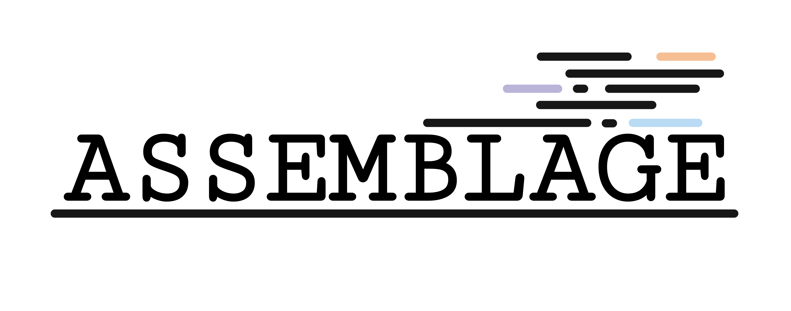

# Assemblage

Assemblage is a nextflow pipeline used for generating assemblies.
Documentation can be found [here](https://github.com/NorwegianVeterinaryInstitute/Assemblage/wiki).
The pipeline is currently under construction, but the plan is to generate the following tracks:

### Draft genome assembly
This track generates assemblies using the normal Illumina paired-end reads.

Status: Complete

### Hybrid genome assembly
This track generates assemblies based on both Illumina and Nanopore reads, using hybrid assembly.

Status: Under construction

### Optimized genome assembly
This track is using the long-read-first assembly method, compares that to a hybrid assembly, and merges all plasmid sequences by the use of trycycler.

Status: Not yet started
